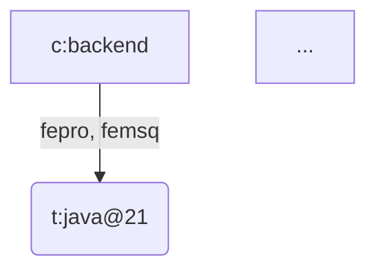

# Чат: Создание общего графа проектов в ArangoDB

**Дата:** 2025-10-14  
**Тема:** Построение общего графа проектов (common project graph)  
**Участники:** Александр, Claude (Cursor AI)  
**Проекты:** fepro, femsq, fedoc

---

## Обзор чата

В этом чате была выполнена масштабная работа по созданию "общего графа проектов" в ArangoDB для системы fedoc. Граф предназначен для:
- Хранения знаний о технологиях и архитектуре проектов
- Сбора правил для AI-ассистента при работе с артефактами
- Отражения связей между проектами через общие элементы графа

---

## Основные этапы работы

### 1. Подготовка и планирование

**Прочитана документация проекта:**
- README.md, docker/*.md
- docs/concepts/, docs/project-history/
- examples/femsq/

**Сформулирована задача:**
- Построить DAG граф с вершинами "проект" и "объекты разработки"
- В рёбрах отразить списки проектов
- Поддержать множественные пути подъёма для сбора правил

### 2. Проверка доступности ArangoDB

```bash
# Статус контейнера
ssh user1@176.108.244.252 "cd /home/user1/fedoc/docker && ./db-manager.sh status"

# Результат: ArangoDB Up (unhealthy) - работает, но healthcheck временно недоступен

# Установка python-arango
pip3 install python-arango --user

# Проверка подключения
python3 -c "import requests; r = requests.get('http://localhost:8529/_api/version', auth=('root', 'aR@ng0Pr0d2025xK9mN8pL')); print(r.status_code); print(r.text)"
# ✅ 200 OK, версия 3.11.14
```

### 3. Создание базовой структуры

**Добавлен проект fedoc:**
```python
{
    "_key": "fedoc",
    "name": "fedoc",
    "fullName": "FEMSQ Documentation System",
    "description": "Централизованная система правил и проектной документации",
    "status": "active"
}
```

**Созданы базовые узлы:**
```python
# Концептуальные
c:project          # Проект
c:dev-objects      # Объекты разработки

# Созданы коллекции
canonical_nodes    # Document collection
project_relations  # Edge collection
common_project_graph  # Named Graph
```

**Первое ребро:**
```python
{
    "_from": "canonical_nodes/c:project",
    "_to": "canonical_nodes/c:dev-objects",
    "relationType": "contains",
    "projects": ["fepro", "femsq", "fedoc"],
    "weight": 3
}
```

### 4. Определение путей к базам данных

**Анализ архитектуры проектов:**
- **fepro**: Объекты разработки → Слой → Бэкенд → БД бэкенда → PostgreSQL
- **femsq**: Объекты разработки → Слой → Бэкенд → БД бэкенда → MS SQL Server
- **fedoc**: Объекты разработки → БД проекта → ArangoDB

**Ключевое решение:**
Создать два отдельных узла БД:
- `c:project-database` (БД проекта) - для fedoc
- `c:backend-database` (БД бэкенда) - для fepro/femsq

**Обоснование:**
- Правила для "БД в корне" могут отличаться от правил "БД бэкенда"
- AI-ассистент должен чётко различать контексты
- В будущем можно добавить ребро `c:backend-database → c:project-database` для наследования правил

### 5. Сокращение префиксов

**Проблема:** `concept:backend-security` слишком длинный, тяжело читать

**Решение:**
```python
# Было: concept:project, tech:java@21
# Стало: c:project, t:java@21
```

**Переименовано:**
- 14 концептуальных узлов (`concept:` → `c:`)
- 14 технологических узлов (`tech:` → `t:`)
- Обновлены все ссылки в 27 рёбрах

**Результат:** Значительно улучшена читаемость графа

### 6. Упрощение структуры рёбер

**Проблема:** Поле `evidence` занимало ~40-50% размера документа

**Было:**
```json
{
  "evidence": [
    {"project": "fepro", "source": "/path/to/file.json", "path": "/architecture/backend", "extractedAt": "..."},
    {"project": "femsq", "source": "/path/to/file.json", "path": "/architecture/backend", "extractedAt": "..."}
  ]
}
```

**Стало:**
```json
{
  "source": "project-documentation"
}
```

**Результат:** Экономия ~31% места на документ (750 → 515 байт)

### 7. Раскрытие структуры бэкенда

**Анализ project-docs.json:**
- framework: Spring Boot 3.4.5
- language: Java 21 LTS
- api: GraphQL
- security: JWT + Spring Security (fepro) / нет (femsq)
- cache: Hazelcast + Caffeine (fepro)
- reactive: R2DBC (fepro)
- migrations: Liquibase
- monitoring: Spring Boot Actuator

**Ключевое решение - иерархия зависимостей:**
```
c:backend
└─→ c:backend-stack
    └─→ t:java@21
        └─→ c:backend-framework
            └─→ t:spring-boot@3.4.5
                ├─→ элементы фреймворка
```

**Обоснование:**
- GraphQL работает в контексте Spring Boot
- Liquibase работает в контексте Spring Boot
- Каждый уровень зависит от предыдущего ("без чего не может быть")

### 8. Исправление структуры безопасности

**Проблема:** Узел `c:backend-security` содержал смешанную информацию

**Было:**
```
c:backend-security
├─→ t:jwt (fepro)
├─→ t:spring-security (fepro)
└─→ t:no-auth (femsq)
```

**Стало:**
```
c:backend-security
├─→ c:with-security (fepro)
│   ├─→ t:jwt
│   └─→ t:spring-security
└─→ c:no-security (femsq)
```

**Результат:**
- Чёткое разделение: есть безопасность / нет безопасности
- Правильная семантика для каждого проекта

### 9. Добавление альтернативных стеков

**Для наглядности добавлены:**

**Python/FastAPI:**
```
t:python@3.11 → t:fastapi
├─→ c:backend-api → [t:graphql, t:rest]
├─→ c:backend-security → t:jwt
├─→ c:backend-migrations → t:alembic
└─→ c:backend-monitoring → t:prometheus
```

**Node.js/Express:**
```
t:node@18 → t:express
├─→ c:backend-api → [t:graphql, t:rest]
└─→ c:backend-security → t:jwt
```

**REST API:**
- Добавлен `t:rest` как альтернатива GraphQL
- `projects: []` - показывает возможность, но не используется реально

**Примечание:**
- fepro и femsq используют только GraphQL
- REST, Python и Node.js - для демонстрации возможных альтернатив

### 10. Восстановление Tom-Select в Graph Viewer

**Проблема:** Утеряна функциональность комбобокса с поиском

**Восстановлено в `web_viewer.py`:**

```javascript
// Добавлена инициализация Tom-Select
tomSelectInstance = new TomSelect('#start', {
  options: options,              // Все узлы из ArangoDB
  maxOptions: null,              // Показывать все
  create: false,                 // Не разрешать создание
  sortField: 'text',
  searchField: ['text', 'searchText'],  // Поиск по ключу и имени
  placeholder: 'Начните вводить для поиска...',
  // ... рендеринг опций
});
```

**Добавлена обработка статических файлов:**
```python
# Обработка /lib/tom-select/*
if self.path.startswith('/lib/tom-select/'):
    file_path = Path(__file__).parent / self.path.lstrip('/')
    if file_path.exists():
        content_type = 'text/css' if file_path.suffix == '.css' else 'application/javascript'
        # ... отдать файл
```

**Результат:**
- ✅ Tom-Select успешно загружается (видно в логах)
- ✅ Динамическая загрузка узлов работает
- ✅ Фильтрация по мере ввода
- ✅ Обновление списка при смене проекта

### 11. Создание визуализаций

**Graphviz (DOT):**
```python
# Генерация DOT файла
dot = ['digraph CommonProjectGraph {']
dot.append('  rankdir=TB;')
# ... добавление узлов и рёбер
# Сохранение и рендеринг
dot -Tpng common-project-graph.dot -o common-project-graph.png
dot -Tsvg common-project-graph.dot -o common-project-graph.svg
```

**Результат:**
- PNG изображение (250 KB)
- SVG изображение (37 KB, масштабируемое)
- DOT исходник (5.7 KB)

**Mermaid диаграмма:**


**Текстовые деревья:**
```
c:backend
├─ c:backend-database [fepro, femsq]
│  └─ t:postgresql@16 [fepro]
├─ c:backend-framework [fepro, femsq]
│  └─ t:spring-boot@3.4.5 [fepro, femsq]
    ├─ c:backend-api [fepro, femsq]
      └─ t:graphql [fepro, femsq]
```

---

## Технические детали

### Структура узла (минималистичная)

```json
{
  "_key": "c:backend-api",
  "kind": "concept",
  "name": "API бэкенда",
  "description": "Интерфейс прикладного программирования",
  "metadata": {
    "created": "2025-10-14T..."
  }
}
```

**Без полей:** `slug`, `path`, `fullPath`, `evidence`

**Обоснование:** Пути строятся динамически при обходе графа, не нужно хранить

### Структура ребра (минималистичная)

```json
{
  "_from": "canonical_nodes/t:spring-boot@3.4.5",
  "_to": "canonical_nodes/c:backend-api",
  "relationType": "contains",
  "projects": ["fepro", "femsq"],
  "source": "project-documentation",
  "weight": 2,
  "metadata": {
    "created": "2025-10-14T...",
    "lastUpdated": "2025-10-14T..."
  }
}
```

**Без полей:** `evidence` (массив), `path`, `paths`, `localPath`

**Обоснование:** 
- Экономия ~31% места
- Упрощение структуры
- Пути строятся динамически

### Алгоритм сбора правил (концепция)

```python
def collect_rules_for_artifact(artifact_node_id, project_key):
    """
    Собрать все правила для конкретного артефакта,
    поднимаясь по графу вверх по всем возможным путям (DAG).
    """
    visited = set()
    all_rules = []
    
    def traverse_upward(node_id, depth=0):
        if node_id in visited:
            return
        visited.add(node_id)
        
        # Собрать правила текущего узла
        node = get_node_by_id(node_id)
        if 'rules' in node:
            all_rules.append({
                "node": node['name'],
                "depth": depth,
                "rules": node['rules']
            })
        
        # Найти все входящие рёбра (родители)
        query = """
            FOR edge IN project_relations
                FILTER edge._to == @node_id
                FILTER @project IN edge.projects
                RETURN edge._from
        """
        parents = db.aql.execute(query, bind_vars={'node_id': node_id, 'project': project_key})
        
        # Рекурсивно обойти всех родителей
        for parent_id in parents:
            traverse_upward(parent_id, depth + 1)
    
    traverse_upward(artifact_node_id)
    
    # Сортировать по глубине (ближайшие = выше приоритет)
    all_rules.sort(key=lambda x: x['depth'])
    
    return all_rules
```

### Пример использования для документации проекта

```python
def collect_project_documentation(project_key):
    """
    Собрать всю документацию проекта, обходя граф сверху вниз.
    Возвращает полную структуру проекта со всеми технологиями.
    """
    result = {
        "project": project_key,
        "technologies": [],
        "architecture": {}
    }
    
    # Обойти граф от проекта вниз
    # Для каждого узла с projects=[project_key] собрать информацию
    # Построить документацию из графа
    
    return result
```

---

## Итоговая структура графа

### Статистика

- **Узлов:** 38 (17 концептуальных + 21 технологический)
- **Рёбер:** 62 (47 реальных + 15 альтернативных)
- **Проектов:** 3 (fepro, femsq, fedoc)

### Узлы по категориям

**Концептуальные (c:) - 17:**
- c:project, c:dev-objects, c:layer, c:backend
- c:backend-stack, c:backend-framework, c:backend-language
- c:backend-api, c:backend-security, c:with-security, c:no-security
- c:backend-reactive, c:backend-cache, c:backend-migrations, c:backend-monitoring
- c:backend-database, c:project-database

**Технологические (t:) - 21:**
- Языки: t:java@21, t:python@3.11, t:node@18
- Фреймворки: t:spring-boot@3.4.5, t:fastapi, t:express
- API: t:graphql, t:rest
- Безопасность: t:jwt, t:spring-security, t:no-auth
- Реактивность: t:r2dbc
- Кэш: t:hazelcast, t:caffeine
- Миграции: t:liquibase, t:alembic
- Мониторинг: t:spring-actuator, t:prometheus
- БД: t:postgresql@16, t:mssql@2022, t:arangodb@3.11

### Типы связей

- `contains` - иерархическое вложение (30 рёбер)
- `implementedBy` - реализация через технологию (20 рёбер)
- `uses` - использование (10 рёбер)
- `variant` - вариант реализации (2 ребра)

### Примеры путей

**FEPRO (PostgreSQL):**
```
PostgreSQL → БД бэкенда → Бэкенд → Слой → Объекты разработки → Проект
(6 уровней)

Параллельно от Бэкенда:
Бэкенд → Стек → Java 21 → Фреймворк → Spring Boot
  ├─→ API → GraphQL
  ├─→ Security → With Security → JWT + Spring Security
  ├─→ Reactive → R2DBC
  ├─→ Cache → Hazelcast + Caffeine
  ├─→ Migrations → Liquibase
  └─→ Monitoring → Spring Actuator
```

**FEMSQ (MS SQL Server):**
```
MS SQL Server → БД бэкенда → Бэкенд → Слой → Объекты разработки → Проект
(6 уровней)

От Бэкенда:
Бэкенд → Стек → Java 21 → Фреймворк → Spring Boot
  ├─→ API → GraphQL
  ├─→ Security → No Security
  ├─→ Migrations → Liquibase
  └─→ (нет Cache, Reactive, Monitoring с проектами)
```

**FEDOC (ArangoDB):**
```
ArangoDB → БД проекта → Объекты разработки → Проект
(4 уровня)
```

---

## Использованные команды

### Python (ArangoDB)

```python
# Подключение
from arango import ArangoClient
client = ArangoClient(hosts='http://localhost:8529')
db = client.db('fedoc', username='root', password='aR@ng0Pr0d2025xK9mN8pL')

# Создание узла
db.collection('canonical_nodes').insert({
    "_key": "c:backend-api",
    "kind": "concept",
    "name": "API бэкенда"
}, overwrite=True)

# Создание ребра
db.collection('project_relations').insert({
    "_from": "canonical_nodes/c:backend",
    "_to": "canonical_nodes/c:backend-api",
    "relationType": "contains",
    "projects": ["fepro", "femsq"]
}, overwrite=True)

# Траверс графа
cursor = db.aql.execute("""
    FOR v, e, p IN 1..10 INBOUND 'canonical_nodes/t:postgresql@16' 
    GRAPH 'common_project_graph'
    FILTER 'fepro' IN e.projects
    RETURN {depth: LENGTH(p.edges), node: v.name, relation: e.relationType}
""")
```

### AQL запросы

```aql
-- Все узлы проекта FEPRO
FOR v, e IN 1..10 OUTBOUND 'canonical_nodes/c:backend'
    GRAPH 'common_project_graph'
    FILTER 'fepro' IN e.projects
    RETURN DISTINCT v

-- Технологии проекта
FOR v, e IN 1..10 OUTBOUND 'canonical_nodes/c:backend'
    GRAPH 'common_project_graph'
    FILTER 'fepro' IN e.projects AND v.kind == 'technology'
    RETURN DISTINCT v.name

-- Альтернативные стеки (без проектов)
FOR e IN project_relations
    FILTER LENGTH(e.projects) == 0
    RETURN DISTINCT e
```

### Git

```bash
# Коммит изменений
git add GRAPH-VISUALIZATION.md docs/project-history/chat-2025-10-14-common-project-graph.md
git commit -m "Создан общий граф проектов в ArangoDB"
git pull --rebase origin main
git push origin main
```

### Визуализация

```bash
# Graphviz
dot -Tpng common-project-graph.dot -o common-project-graph.png
dot -Tsvg common-project-graph.dot -o common-project-graph.svg

# Graph Viewer с Tom-Select
cd /home/alex/tools/arango-graph-viewer
./view-graph.sh --project fepro
```

---

## Созданные файлы

### В проекте fedoc

**Документация:**
- `GRAPH-VISUALIZATION.md` - инструкции по визуализации
- `docs/chats/chat-2025-10-14-common-project-graph-full.md` - этот файл
- `docs/project-history/chat-2025-10-14-common-project-graph.md` - краткий отчёт

**Визуализации (не в git):**
- `common-project-graph.dot` - Graphviz исходник
- `common-project-graph.png` - PNG изображение
- `common-project-graph.svg` - SVG изображение
- `common-project-graph.mmd` - Mermaid диаграмма
- `common-project-graph-fepro.txt` - текстовое дерево FEPRO
- `common-project-graph-femsq.txt` - текстовое дерево FEMSQ

### В arango-graph-viewer (локальный инструмент)

**Обновлённые файлы:**
- `web_viewer.py` - добавлен Tom-Select с динамической загрузкой узлов
- `view-graph.sh` - переключён на динамический сервер

---

## Ключевые решения и их обоснование

### 1. Использование только `_key` в массиве `projects`

**Решение:** `projects: ["fepro", "femsq"]`  
**Альтернативы:** `_id`, `_rev`, объекты с метаданными  
**Выбрано:** `_key`

**Обоснование:**
- Компактность
- Стабильность (_key не меняется)
- Простота запросов (`'fepro' IN e.projects`)
- Легко агрегировать при upsert

### 2. Два узла БД вместо одного

**Решение:** `c:project-database` и `c:backend-database`  
**Альтернатива:** Один узел `c:database` с контекстом в рёбрах

**Обоснование:**
- Чёткое разделение ролей
- Правила для "БД корня" ≠ правила "БД бэкенда"
- AI точно знает источник правил
- Масштабируемость (легко добавить другие типы БД)

### 3. Короткие префиксы `c:` и `t:`

**Решение:** `c:backend`, `t:java@21`  
**Альтернатива:** `concept:backend`, `tech:java@21`

**Обоснование:**
- Улучшена читаемость в диаграммах
- Меньше визуального шума
- Сохранена ясность (_key всё равно уникален)

### 4. Без хранения путей в узлах/рёбрах

**Решение:** Пути строятся динамически при обходе  
**Альтернатива:** Поле `path` или `paths` в рёбрах/узлах

**Обоснование:**
- В DAG может быть несколько путей к узлу
- Добавление/удаление ребра не требует пересчёта всех путей
- Гибкость при изменении структуры графа
- Не дублируем информацию

### 5. Упрощение evidence

**Решение:** Одно поле `source: "project-documentation"`  
**Альтернатива:** Массив `evidence` с деталями по каждому проекту

**Обоснование:**
- Экономия ~31% места
- Вся необходимая информация в других полях
- Трассируемость сохранена через `source`
- Проще поддерживать и обновлять

### 6. Разделение безопасности на варианты

**Решение:** `c:with-security` и `c:no-security`  
**Альтернатива:** Смешанная структура с разными технологиями под одним узлом

**Обоснование:**
- Чёткая семантика: есть/нет безопасности
- Для femsq явно обозначено отсутствие
- Правильная структура для сбора правил
- Нет путаницы при обходе графа

### 7. Альтернативные стеки с пустым массивом проектов

**Решение:** `projects: []` для Python/FastAPI, Node.js/Express  
**Альтернатива:** Не создавать альтернативные стеки

**Обоснование:**
- Наглядность возможных архитектур
- Показ альтернатив (REST вместо GraphQL)
- Легко добавить проект к альтернативному стеку
- Документирование технологических возможностей

---

## Полезные запросы

### Получить все технологии проекта FEPRO

```aql
FOR v, e IN 1..10 OUTBOUND 'canonical_nodes/c:backend'
    GRAPH 'common_project_graph'
    FILTER 'fepro' IN e.projects AND v.kind == 'technology'
    RETURN DISTINCT {
        key: v._key,
        name: v.name,
        tags: v.tags
    }
```

### Найти общие технологии между FEPRO и FEMSQ

```aql
FOR e IN project_relations
    FILTER 'fepro' IN e.projects AND 'femsq' IN e.projects
    LET to_node = DOCUMENT(e._to)
    FILTER to_node.kind == 'technology'
    RETURN DISTINCT to_node.name
```

### Построить путь от артефакта к проекту

```aql
FOR v, e, p IN 1..15 INBOUND 'canonical_nodes/t:postgresql@16'
    GRAPH 'common_project_graph'
    FILTER 'fepro' IN e.projects
    RETURN {
        depth: LENGTH(p.edges),
        path: p.vertices[*].name,
        node: v.name
    }
```

---

## Следующие шаги

### Расширение графа

1. **Добавить элементы фронтенда:**
   - c:frontend → t:vue@3.4.21 → t:quasar → t:typescript
   - c:frontend → t:vite (сборщик)
   - c:frontend → t:apollo-client (GraphQL клиент)

2. **Добавить инфраструктуру:**
   - c:infrastructure → c:containerization → t:docker
   - c:infrastructure → c:deployment → [t:docker-compose, t:kubernetes]

3. **Добавить build tools:**
   - c:build → t:maven (для Java)
   - c:build → t:pip (для Python)
   - c:build → t:npm (для Node.js)

### Система правил

1. **Создать коллекцию rules:**
   - Структура правила
   - Приоритеты
   - Область применения (scope)

2. **Создать edge collection rule_assignments:**
   - Связь узла графа с правилами
   - Условия применения
   - Приоритеты наследования

3. **Реализовать алгоритм сбора правил:**
   - Подъём вверх по графу
   - Агрегация из всех путей
   - Разрешение конфликтов

### Интеграция с Cursor AI

1. **MCP Server для fedoc:**
   - Инструмент получения правил для артефакта
   - Инструмент поиска в графе
   - Инструмент построения документации

2. **Автоматизация:**
   - Извлечение данных из project-docs.json
   - Автоматическое обновление графа
   - Валидация структуры

---

## Выводы

### Что получилось хорошо

1. ✅ **Правильная архитектура зависимостей** - отражает реальную структуру
2. ✅ **Минималистичная структура данных** - экономия места, простота
3. ✅ **DAG поддержка** - множественные пути для сбора правил
4. ✅ **Отличные инструменты визуализации** - 4 формата для разных задач
5. ✅ **Tom-Select восстановлен** - удобный выбор вершин с поиском

### Что требует внимания

1. ⚠️ **ArangoDB healthcheck** - помечен как unhealthy (но работает)
2. ⚠️ **Дубликаты в текстовых деревьях** - одни узлы повторяются (из-за DAG)
3. ⚠️ **Альтернативные стеки** - много рёбер без проектов (15 из 62)

### Рекомендации

1. **Использовать Graph Viewer** вместо ArangoDB Web UI - намного удобнее
2. **SVG формат** для просмотра графа - масштабируется без потери качества
3. **Текстовые деревья** для быстрого поиска конкретных элементов
4. **Tom-Select** для выбора стартовых вершин - поиск по мере ввода

---

**Дата чата:** 2025-10-14  
**Длительность:** ~2 часа  
**Автор сводки:** Claude (Cursor AI)  
**Статус:** ✅ Завершено, граф готов к использованию

